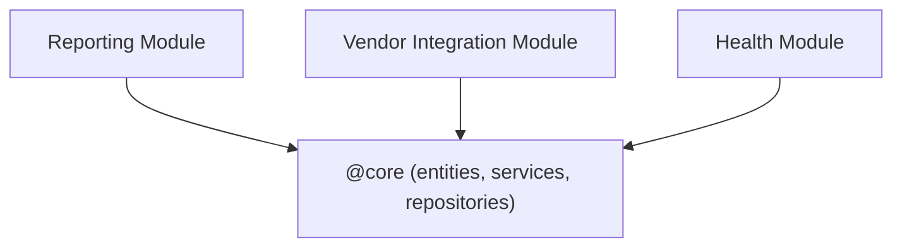

# REPORT.md

## Architecture Overview

This backend service is built with [NestJS](https://nestjs.com/) and follows a modular, layered architecture to ensure maintainability, scalability, and testability. The main components are:

- **Core Module (`@core`)**: Contains business logic, controllers, services, repositories, and scheduled jobs for stock, portfolio, transaction, and report management. All business entities and contracts are defined here, making it the single source of truth for the domain model.
- **Shared Module**: Provides shared utilities, including vendor API integration and database base entities.
- **Health Module**: Exposes health check endpoints for monitoring.
- **Database**: PostgreSQL, managed via TypeORM ORM, with entities for User, Portfolio, Stock, Transaction, and Report.
- **Vendor API Integration**: Communicates with the external (mock) stock vendor API, with robust error handling and retry logic.
- **Email Delivery**: Uses Nodemailer for sending daily HTML email reports.
- **Distributed Locking**: Ensures scheduled jobs (like report generation) are not run concurrently across multiple instances.

---

## Domain-Driven Modular Architecture and the `@core` Module

This project follows a domain-driven modular architecture, with a dedicated `@core` module that encapsulates all business entities, logic, and contracts. The `@core` module is the only module that other feature modules (e.g., reporting, vendor integration, health) are allowed to depend on, preventing circular dependencies and ensuring a clear domain boundary.

**Key points:**

- All entities (User, Portfolio, Stock, Transaction, Report) and their repositories/services are defined in `@core`.
- Feature modules import from `@core` but never from each other, preventing circular dependencies.
- This structure is enforced using TypeScript path aliases (e.g., `@core/*`), configured in `tsconfig.json`.
- Barrel files (`index.ts`) are used in each folder to control exports and further reduce accidental circular imports.

#### Why are entities highly coupled and in the same domain?

In this financial backend, the core business logic requires tight integration between users, portfolios, stocks, transactions, and reports. For example, generating a report requires traversing user portfolios, their holdings, and related transactions. Splitting these entities into separate modules would introduce unnecessary complexity and potential for circular dependencies. By keeping them together in `@core`, we ensure:

- High cohesion and clear business boundaries.
- Simpler dependency management.
- Easier enforcement of domain invariants.

#### Module Import Graph



> **Note:** Only `@core` is allowed as a dependency for feature modules. Feature modules must not depend on each other.

---

## Key Design Decisions

### 1. **Framework: NestJS**

- Chosen for its modularity, dependency injection, and first-class TypeScript support.
- Encourages separation of concerns and testability.

### 2. **Database: PostgreSQL + TypeORM**

- PostgreSQL is robust and widely supported.
- TypeORM provides a flexible, strongly-typed ORM with migration support.
- Entities are organized by domain (User, Portfolio, Stock, Transaction, Report).

### 3. **Vendor API Integration**

- All vendor API calls are encapsulated in the `VendorApiService`.
- Retries and timeouts are configurable via environment variables.
- Input validation and error handling are enforced at the service level.

### 4. **Distributed Locking for Scheduled Jobs**

- A DB-based locking mechanism prevents duplicate report generation in distributed deployments.
- Locking is implemented in the report scheduler job and can be extended for other jobs.

### 5. **Email Delivery & Report Formatting**

- Reports are formatted as responsive HTML emails for readability across devices.
- Email delivery is handled by a dedicated service, with configuration via environment variables.

### 6. **Error Handling & Monitoring**

- All errors are logged using NestJS Logger.
- Health checks are exposed for liveness/readiness probes.

### 7. **Testing**

- Unit and e2e tests are provided for core modules and services.
- Test strategy follows Arrange-Act-Assert and Given-When-Then conventions.

---

## Extensibility & Reliability

- **Modular structure** allows for easy addition of new features (e.g., new report types, notification channels).
- **Environment-based configuration** supports multiple deployment environments.
- **Robust error handling** and distributed locking ensure reliability in production.
- **Docker and docker-compose** enable reproducible local and CI environments.

---

## Circular Dependency Avoidance

- All business logic and entities are centralized in `@core`.
- Feature modules only import from `@core`, never from each other.
- TypeScript path aliases and barrel files help enforce this boundary.
- This approach prevents circular dependencies and keeps the codebase maintainable as it grows.

---

## Tradeoffs & Alternatives

- **TypeORM** was chosen for its integration with NestJS, but alternatives like Prisma or Sequelize could be considered for different use cases.
- **DB-based locking** is simple and effective for this scale; for higher throughput, a distributed cache (e.g., Redis) could be used.
- **Nodemailer** is used for email; for production, a transactional email service (e.g., SendGrid, SES) is recommended.
- **No user management endpoints** are implemented, as per requirements, but the architecture supports easy extension.

---

## References

- See `home-task.md` for the original challenge description.
- See `README.md` for setup and usage instructions.
- See `api-keys.txt` for sample credentials and API keys.

---

## (Optional) Example tsconfig Path Alias

```json
{
  "compilerOptions": {
    "baseUrl": "./src",
    "paths": {
      "@core/*": ["modules/core/*"]
    }
  }
}
```
